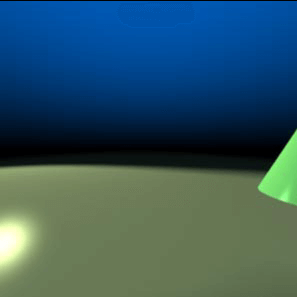
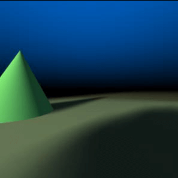
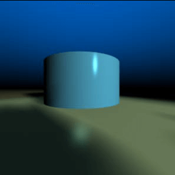
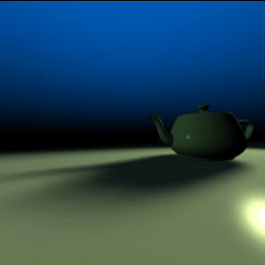
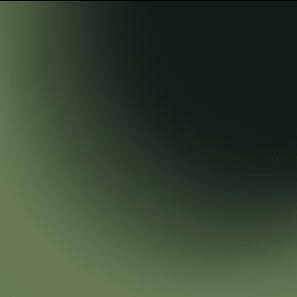
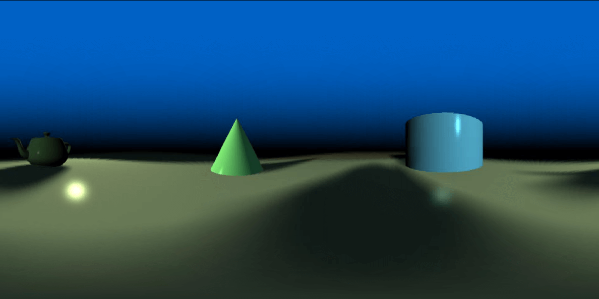

# libcube2cyl

libcube2cyl is a panoramic lib, for cubic to cylindrical projection conversion.

libcube2cyl is a single header file library, available in both C and C++.

A picture is worth a thousand words.

The input:

||  |||
|----- |:-------------:| -----:|-----:|
| ||| |
|   |       |   | |

The output:



## Basic definitions

The origin (0, 0) position of the panorama will match the cubic images.

The diagonal point is (width-1, height-1).

Read more details of implementation here: http://www.wenyanan.com/cube2cyl/


## How to use

Please check /example/demo_c for C version usage.

```c++
    // Create an instance of Cube2Cyl algorithm
    Cube2Cyl algo;

    /*
       Initialise the algorithm:
         the width of each input is 640 pixel,
         the vertical view portion is PI (180 degrees),
         the horizontal view portion is 2*PI (360 degress).

       In this case, the output image size will be calculated accordingly.
       There is another more detailed init function you can play with.
     */
    algo.init(640, M_PI, 2.0*M_PI);

    // Generate the mapping from panorama to cubic
    algo.genMap();

    // Access the dimension of the paranoma image
    unsigned int panoWidth  = algo.pxPanoSizeH;
    unsigned int panoHeight = algo.pxPanoSizeV;

    // The next step is to map the pixels from the paranoma back to the source images
    for (i = 0; i < panoWidth; ++i) {
        for (j = 0; j < panoHeight; ++j) {
            // Get the corresponding position of (i, j)
            coord = algo.getCoord(i, j);

            // Which side of the cube
            coord->face;
            // The x coordinate of the cube
            coord->x;
            // The y coordinate of the cube
            coord->y;
        }
    }
```

This library takes any valid parameter and deals the ratio changes automatically. You can use super sampling to generate accurate panorama and deal with anti-aliasing.


## Building

You don't need to build the project to use libcube2cyl. This section is only for the examples.

CMake scripts are provided for easy compilation.

Please install CMake first, then you can find the build scritps in `/build`.

For Linux: run `build.sh`.
The ouput will be put in `/build/linux/fin`.

For Win32 with MSVS: you need to start `Native Tools Command Prompt` first, then run `build.bat`.
The ouput will be put in `/build/win32_msc/fin`.

You can find the compiled binaries in `/fin/bin`.

To use the demo, put the test images along with the executable file and run.

The output file will be named as "PANO.bmp".


## Test images

There are two sets of images for testing, you are free to use these images for testing purposes.

## Contact

If you find any problems please raise issues on github. If you have other questions, you can also send me an email: madwyn+src at gmail dot com.

## License

[MIT license](https://github.com/madwyn/Cube2Cyl/blob/master/LICENSE) meaning that you can use it freely for private or commercial purposes.
